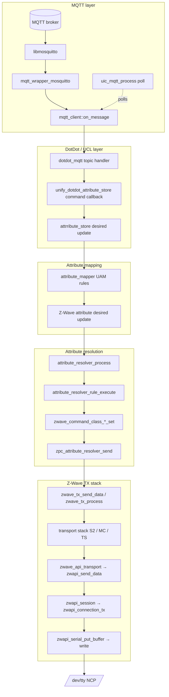
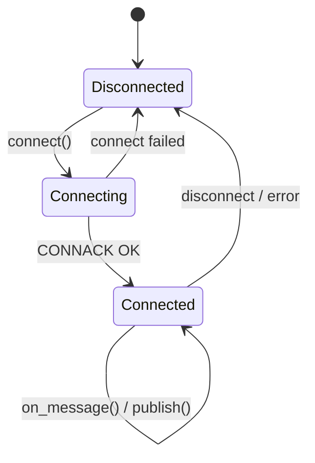
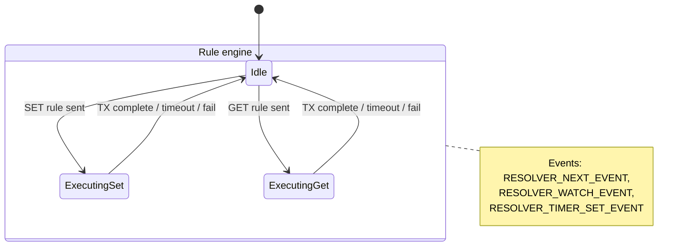
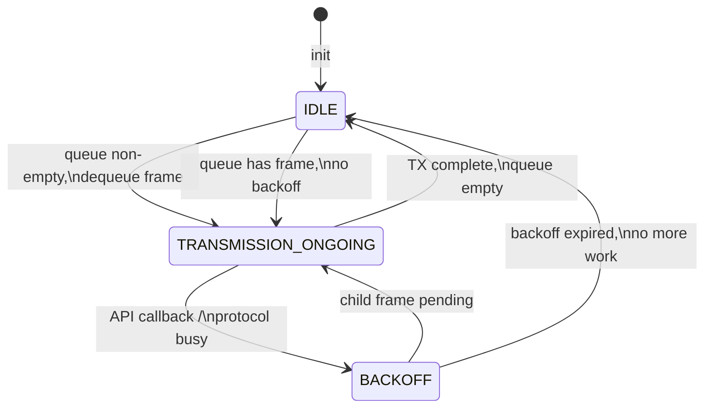
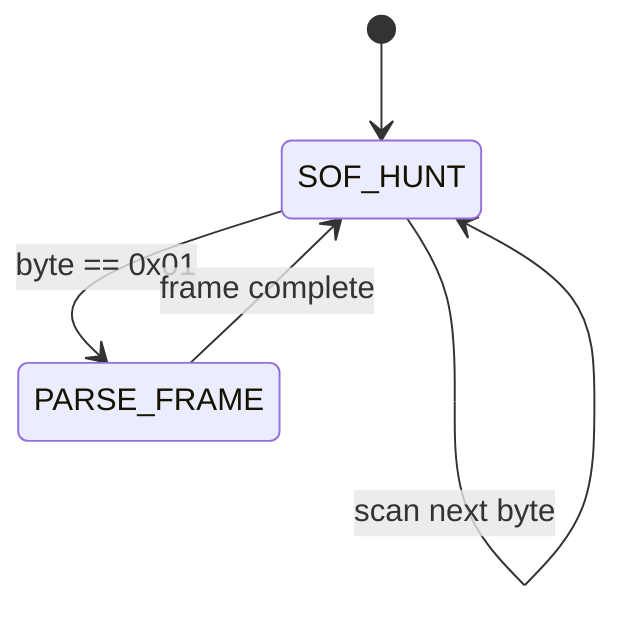
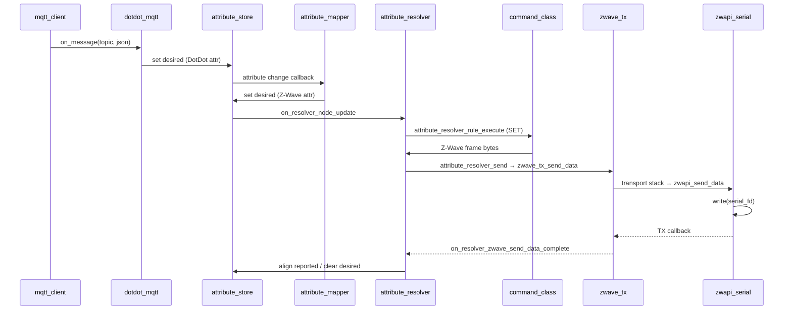

# ZPC: MQTT to Serial Code Flow

This document traces how an outbound device command travels through ZPC (Z-Wave Protocol Controller) from an MQTT message on the broker to bytes on the NCP serial port.

**Scope:** outbound path only (MQTT command → Z-Wave TX). The reverse path (serial RX → MQTT publish) is documented in [Serial to MQTT Code Flow](serial_to_mqtt_flow.md).

**Transport note:** ZPC on `release/1.6.x` talks to the Z-Wave NCP over the legacy **Serial API** (`zwapi_serial` → `write(serial_fd)`). CPC (`externals/cpcd/`) is vendored but not used on this TX path.

---

## End-to-end overview



All device-command MQTT paths converge on:

**attribute_store (desired) → attribute_mapper → attribute_resolver → zwave_tx → zwapi_serial**

---

## Canonical example: `OnOff/Commands/On`

**MQTT topic:**

```
ucl/by-unid/{unid}/{endpoint}/OnOff/Commands/On
```

**Payload:** JSON (often `{}` for On).

| Step | Component | File | Function |
|------|-----------|------|----------|
| 1 | Mosquitto callback | `components/uic_mqtt/src/mqtt_wrapper_mosquitto.cpp` | `mqtt_wrapper_on_message_mosquitto()` |
| 2 | Topic dispatch | `components/uic_mqtt/src/mqtt_client.cpp` | `mqtt_client::on_message()` |
| 3 | DotDot handler | `components/uic_dotdot_mqtt/zap-generated/src/dotdot_mqtt.cpp` | `uic_mqtt_dotdot_on_on_off_on()` |
| 4 | Command callback | `components/unify_dotdot_attribute_store/src/unify_dotdot_attribute_store_command_callbacks_on_off.c` | `on_off_cluster_on_command()` |
| 5 | Attribute store write | `components/unify_dotdot_attribute_store/zap-generated/src/unify_dotdot_attribute_store_helpers.cpp` | `dotdot_set_on_off_on_off(..., DESIRED_ATTRIBUTE, true)` |
| 6 | UAM rule | `applications/zpc/components/dotdot_mapper/rules/OnOff_to_BinarySwitchCC.uam` | `d'zwSWITCH_BINARY_STATE.zwSWITCH_BINARY_VALUE = 255` |
| 7 | Resolver scan | `components/uic_attribute_resolver/src/attribute_resolver.cpp` | `on_resolver_node_update()` → `RESOLVER_NEXT_EVENT` |
| 8 | Rule execution | `components/uic_attribute_resolver/src/attribute_resolver_rule.cpp` | `attribute_resolver_rule_execute()` |
| 9 | Frame build | `applications/zpc/components/zwave_command_classes/src/zwave_command_class_binary_switch.c` | `zwave_command_class_binary_switch_set()` |
| 10 | ZPC send adapter | `applications/zpc/components/zpc_attribute_resolver/src/zpc_attribute_resolver_send.c` | `attribute_resolver_send()` |
| 11 | TX queue | `applications/zpc/components/zwave/zwave_tx/src/zwave_tx.cpp` | `zwave_tx_send_data()` |
| 12 | TX process | `applications/zpc/components/zwave/zwave_tx/src/zwave_tx_process.cpp` | `zwave_controller_transport_send_data()` |
| 13 | Transport stack | `applications/zpc/components/zwave/zwave_transports/` | S2, Multi Channel, Transport Service, … |
| 14 | Serial API | `applications/zpc/components/zwave_api/src/zwapi_protocol_transport.c` | `zwapi_send_data()` (`FUNC_ID_ZW_SEND_DATA`) |
| 15 | Session / framing | `applications/zpc/components/zwave_api/src/zwapi_session.c` | `zwapi_session_send_frame()` |
| 16 | Connection | `applications/zpc/components/zwave_api/src/zwapi_connection.c` | `zwapi_connection_tx()` |
| 17 | Hardware TX | `applications/zpc/components/zwave_api/platform/posix/zwapi_serial.c` | `zwapi_serial_put_buffer()` → `write(serial_fd)` |

### Step 4 detail: MQTT command → desired attribute

When `OnOff/Commands/On` arrives, the command callback sets the DotDot OnOff desired value:

```c
dotdot_set_on_off_on_off(unid, endpoint, DESIRED_ATTRIBUTE, true);
```

See `on_off_cluster_on_command()` in `unify_dotdot_attribute_store_command_callbacks_on_off.c`.

### Step 6 detail: UAM Zigbee → Z-Wave mapping

The attribute mapper evaluates `OnOff_to_BinarySwitchCC.uam`:

```
d'zwSWITCH_BINARY_STATE.zwSWITCH_BINARY_VALUE =
  if (d'zbON_OFF == 0) 0
  if (d'zbON_OFF == 1) 255
  undefined
```

This creates a **desired** Z-Wave Binary Switch value that mismatches **reported**, which the resolver picks up.

### Step 8–10 detail: resolver → serial-bound frame

`attribute_resolver_rule_execute()` calls the registered SET function, then invokes the platform send hook:

```cpp
attribute_resolver_get_config().send(node, frame, frame_size, set_rule);
```

In ZPC this resolves to `attribute_resolver_send()` in `zpc_attribute_resolver_send.c`, which calls `zwave_tx_send_data()` (with optional Supervision encapsulation).

---

## Layer-by-layer breakdown

### 1. MQTT receive and dispatch

| File | Role |
|------|------|
| `components/uic_mqtt/src/mqtt_wrapper_mosquitto.cpp` | libmosquitto wrapper; `mqtt_wrapper_on_message_mosquitto()` forwards to app callback |
| `components/uic_mqtt/src/mqtt_client.cpp` | Connection FSM, subscription table, `mqtt_client::on_message()` wildcard-matches topics |
| `components/uic_mqtt/src/uic_mqtt.c` | Contiki process; polls MQTT socket via `mqtt_client_poll()` |

`mqtt_client::on_message()` iterates all registered `(topic_pattern, callback)` pairs and invokes every match:

```cpp
for (const auto &[cb_topic, callbacks]: subscription_callbacks) {
  mqtt_wrapper_topic_matches_sub(cb_topic.c_str(), topic.c_str(), &match_topic_result);
  if (match_topic_result) {
    for (const callback_info &cb: callbacks) {
      cb.callback(topic.c_str(), message.c_str(), message_length, cb.user);
    }
  }
}
```

DotDot topic subscriptions are registered during `uic_mqtt_dotdot_init()` (generated from ZAP in `components/uic_dotdot_mqtt/zap-generated/`).

### 2. DotDot command → attribute store

| File | Role |
|------|------|
| `components/uic_dotdot_mqtt/zap-generated/src/dotdot_mqtt.cpp` | Parses topic (`parse_topic`) and JSON payload |
| `components/unify_dotdot_attribute_store/src/unify_dotdot_attribute_store.c` | Registers all command / WriteAttributes / Desired callbacks |
| `components/unify_dotdot_attribute_store/src/unify_dotdot_attribute_store_command_callbacks_*.c` | Per-cluster command handlers |

Callbacks are wired at init, e.g.:

```c
uic_mqtt_dotdot_on_off_on_callback_set(&on_off_cluster_on_command);
```

Other inbound MQTT patterns that hit the same downstream chain:

| MQTT pattern | Entry |
|--------------|-------|
| `.../Cluster/Commands/WriteAttributes` | `unify_dotdot_attribute_store_write_attributes_command_callbacks.c` |
| `.../Attributes/{Name}/Desired` | `dotdot_mqtt_attributes.cpp` |
| `ucl/by-group/{id}/OnOff/Commands/On` | `zpc_dotdot_mqtt_group_dispatch.cpp` → per-endpoint handler |

### 3. Attribute mapper (UAM)

| File | Role |
|------|------|
| `components/uic_attribute_mapper/src/attribute_mapper_process.cpp` | Contiki process; evaluates UAM rules on attribute changes |
| `applications/zpc/components/dotdot_mapper/rules/*.uam` | DotDot ↔ Z-Wave attribute linkage rules |

UAM rules translate DotDot cluster attributes to Z-Wave command-class attributes (and vice versa). A command that only touches DotDot attributes may still trigger Z-Wave TX indirectly through these rules.

See also: [How to write UAM files for ZPC](../../../applications/zpc/how_to_write_uam_files_for_the_zpc.md).

### 4. Attribute resolver

| File | Role |
|------|------|
| `components/uic_attribute_resolver/src/attribute_resolver.cpp` | Contiki process; scans attribute tree for desired/reported mismatches |
| `components/uic_attribute_resolver/src/attribute_resolver_rule.cpp` | Rule book; executes SET/GET frame builders |
| `applications/zpc/components/zpc_attribute_resolver/src/zpc_attribute_resolver.c` | Wires ZPC send callbacks into generic resolver |
| `applications/zpc/components/zpc_attribute_resolver/src/zpc_attribute_resolver_send.c` | Maps attribute node → Z-Wave node/endpoint; calls `zwave_tx_send_data()` |
| `applications/zpc/components/zpc_attribute_resolver/src/zpc_attribute_resolver_callbacks.cpp` | TX completion → resolver status (`on_resolver_zwave_send_data_complete`) |
| `applications/zpc/components/zwave_command_classes/src/zwave_command_class_*.c` | Per-CC frame builders registered via `attribute_resolver_register_rule()` |

The resolver walks the attribute store looking for nodes where **desired ≠ reported** (or desired is defined and reported is not), then executes the matching SET or GET rule.

### 5. Z-Wave TX → serial

| File | Role |
|------|------|
| `applications/zpc/components/zwave/zwave_tx/src/zwave_tx.cpp` | Validates frame, enqueues to TX queue |
| `applications/zpc/components/zwave/zwave_tx/src/zwave_tx_process.cpp` | TX state machine; dequeues and sends |
| `applications/zpc/components/zwave/zwave_controller/src/zwave_controller_transport.c` | Walks transport chain by encapsulation scheme |
| `applications/zpc/components/zwave/zwave_transports/zwave_api_transport/src/zwave_api_transport.c` | Bottom transport; calls `zwapi_send_data()` |
| `applications/zpc/components/zwave_api/src/zwapi_protocol_transport.c` | Packs `FUNC_ID_ZW_SEND_DATA` (0x13) |
| `applications/zpc/components/zwave_api/src/zwapi_session.c` | ACK/retry loop |
| `applications/zpc/components/zwave_api/src/zwapi_connection.c` | SOF framing (`0x01` … checksum) |
| `applications/zpc/components/zwave_api/platform/posix/zwapi_serial.c` | `open()` + termios 115200 8N1; `write(serial_fd)` |

Serial port is opened during `zwave_rx_fixt_setup()` from `zpc_config` (`serial_port`, e.g. `/dev/ttyUSB0`).

Transport registration order (outermost to innermost) is in `applications/zpc/components/zwave/zwave_transports/src/zwave_transports_fixt.c`:

1. Multi Channel
2. S0
3. S2
4. Transport Service
5. Multicast follow-ups
6. Z-Wave API (serial)

---

## State machines

### MQTT client connection FSM



Files: `components/uic_mqtt/src/mqtt_client_fsm_*.cpp`

On **Connected**: resubscribe all topics and flush queued publishes.

---

### Attribute resolver process



**Rule engine states** (`attribute_resolver_rule.cpp`):

| State | Meaning |
|-------|---------|
| `RESOLVER_IDLE` | No rule in flight |
| `RESOLVER_EXECUTING_SET_RULE` | SET frame sent, awaiting completion |
| `RESOLVER_EXECUTING_GET_RULE` | GET frame sent, awaiting completion |

**Send status** returned to resolver (`attribute_resolver_rule.h`):

| Status | Typical meaning |
|--------|-----------------|
| `RESOLVER_SEND_STATUS_OK` | TX accepted; may trigger GET verify |
| `RESOLVER_SEND_STATUS_OK_EXECUTION_VERIFIED` | SET verified (supervision or GET) |
| `RESOLVER_SEND_STATUS_OK_EXECUTION_PENDING` | Supervision session ongoing |
| `RESOLVER_SEND_STATUS_FAIL` | TX failed |

After a no-supervision SET where the device reply already updated **reported** via RX, the resolver can skip the follow-up GET (see `attribute_resolver_rule.cpp` SET + `RESOLVER_SEND_STATUS_OK` handling).

---

### Z-Wave TX process



Files: `applications/zpc/components/zwave/zwave_tx/src/zwave_tx_process.cpp`, `zwave_tx_process.h`

Backoff reasons include: current session active, incoming frames expected, Z-Wave protocol busy.

---

### Serial API connection (RX framing; shared with TX path)



File: `applications/zpc/components/zwave_api/src/zwapi_connection.c`

TX path: `zwapi_connection_tx()` builds the framed packet, then `zwapi_serial_put_buffer()` writes to the serial FD.

---

### Combined outbound state flow (simplified)



---

## ZPC initialization order (relevant to this path)

From `applications/zpc/main.c` (abbreviated):

1. `zwave_rx_fixt_setup` — open serial, start Z-Wave API RX
2. `zwave_tx_fixt_setup` — TX queue and process
3. `attribute_store_init`
4. `zpc_attribute_resolver_init` — wire send callbacks
5. `zpc_dotdot_mqtt_init` — group dispatch
6. `dotdot_mapper_init` — load UAM rules
7. `unify_dotdot_attribute_store_init` — **register MQTT command callbacks**
8. `uic_mqtt_dotdot_init` — **subscribe MQTT topics** (must be after callbacks)
9. `zwave_command_classes_init` — **register resolver SET/GET rules**

MQTT client itself starts earlier via `uic_mqtt_setup` in the UIC component fixtures (`components/uic_main/src/uic_component_fixtures_array.c`).

---

## How to trace a command in the field

### 1. Confirm MQTT delivery

Enable debug logging for tag `mqtt_client`:

```
mqtt_client::on_message: ucl/by-unid/.../OnOff/Commands/On
```

### 2. Confirm attribute store update

Look for `unify_dotdot_attribute_store_on_off_commands_callbacks`:

```
Updating ZCL desired values after OnOff::On command
```

### 3. Confirm UAM mapped Z-Wave attribute

Use attribute store introspection (stdin / debug tooling) or logs from `attribute_mapper`.

### 4. Confirm resolver picked up mismatch

Tag: `attribute_resolver` / `attribute_resolver_rule`

Watch for `attribute_resolver_rule_execute` on the Z-Wave Binary Switch attribute type.

### 5. Confirm Z-Wave TX

Tags: `zwave_tx`, `zwave_tx_process`, `attribute_resolver_send_zwave`

### 6. Confirm serial output

- Enable Serial API logging in `zwapi_serial.c` (log file if configured)
- Or use an external serial sniffer on the NCP UART

### Quick grep anchors

```bash
# MQTT dispatch
rg "mqtt_client::on_message" components/uic_mqtt/

# OnOff command entry
rg "on_off_cluster_on_command" components/unify_dotdot_attribute_store/

# Resolver send
rg "attribute_resolver_send" applications/zpc/components/zpc_attribute_resolver/

# Final serial write
rg "zwapi_serial_put_buffer" applications/zpc/components/zwave_api/
```

---

## Key file index

```
components/uic_mqtt/                          # Mosquitto wrapper, client, Contiki process
components/uic_dotdot_mqtt/                   # Generated DotDot MQTT subscribe/publish
components/unify_dotdot_attribute_store/      # MQTT command → attribute store
components/uic_attribute_store/               # Attribute tree (desired / reported)
components/uic_attribute_mapper/              # UAM rule engine
components/uic_attribute_resolver/            # Generic resolver process + rules
applications/zpc/components/
  zpc_attribute_resolver/                     # Z-Wave send adapter + callbacks
  zpc_dotdot_mqtt/                            # Group command dispatch
  dotdot_mapper/rules/*.uam                   # DotDot ↔ Z-Wave attribute links
  zwave_command_classes/                      # Per-CC frame builders
  zwave/zwave_tx/                             # TX queue + process
  zwave/zwave_transports/                     # Encapsulation transport stack
  zwave_api/                                  # Serial API (zwapi_serial)
  zwave/zwave_rx/                             # Serial port open + RX
```

---

## Related documentation

- [ZPC introduction](../../../doc/protocol/zwave/zpc_introduction.md)
- [Serial to MQTT Code Flow](serial_to_mqtt_flow.md) — inbound path (serial RX → MQTT publish)
- [How to write UAM files for ZPC](../how_to_write_uam_files_for_the_zpc.md)
- [How to interact with clusters](../how_to_interact_with_clusters.rst)
- [Supported Command Classes](supported_command_classes.md)
- [Attribute mapper overview](../../../doc/attribute_mapper_overview.md)
