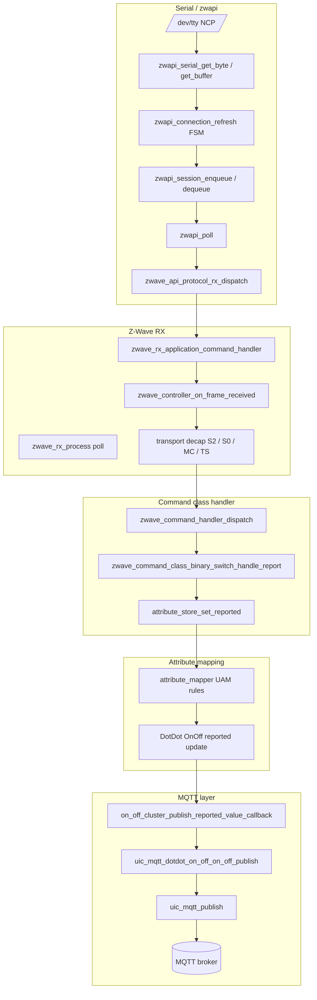
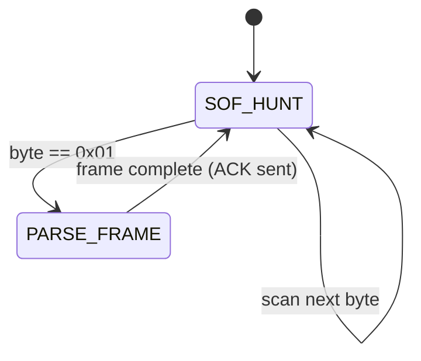
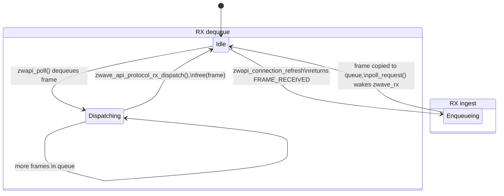
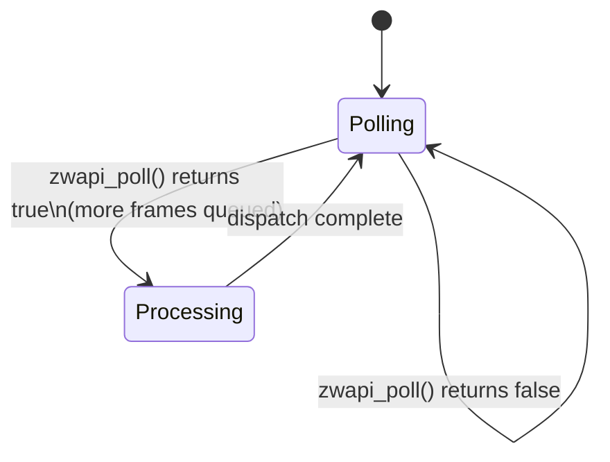
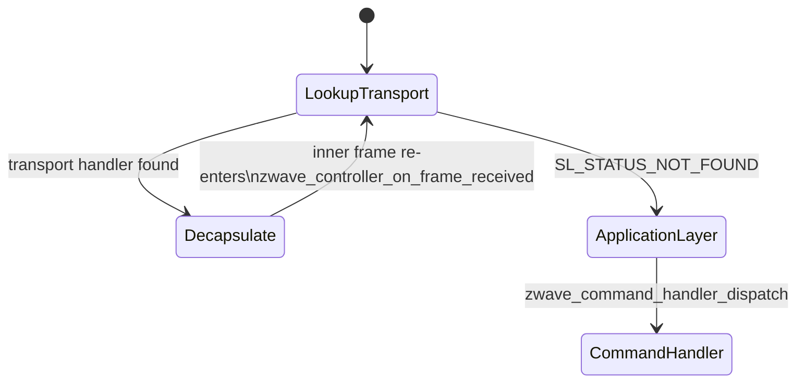
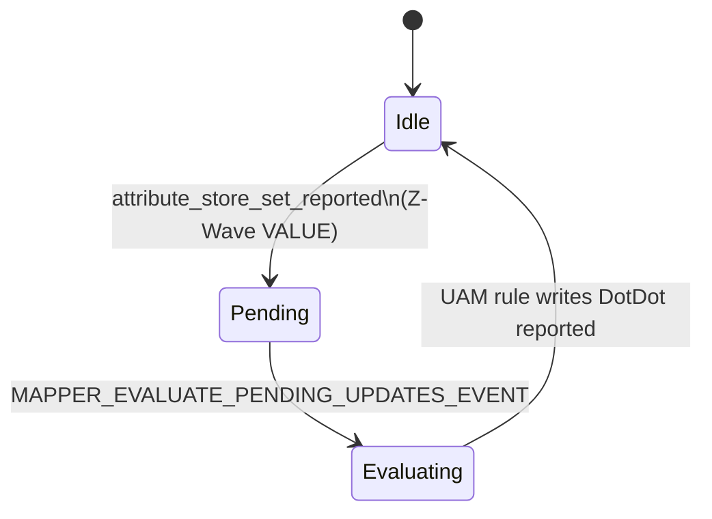
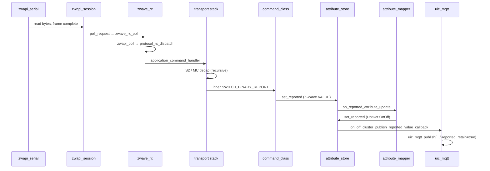

# ZPC: Serial to MQTT Code Flow

This document traces how an inbound Z-Wave frame travels through ZPC (Z-Wave Protocol Controller) from bytes on the NCP serial port to an MQTT publish on the broker.

**Scope:** inbound path only (serial RX → MQTT reported attribute). The reverse path (MQTT command → Z-Wave TX) is documented in [MQTT to Serial Code Flow](mqtt_to_serial_flow.md).

**Transport note:** ZPC on `release/1.6.x` talks to the Z-Wave NCP over the legacy **Serial API** (`zwapi_serial` → `read(serial_fd)`). CPC (`externals/cpcd/`) is vendored but not used on this RX path.

---

## End-to-end overview



All spontaneous device REPORT paths converge on:

**zwapi_serial → zwave_rx → transport decap → command handler → attribute_store (reported) → attribute_mapper → unify_dotdot MQTT publish**

---

## Canonical example: `SWITCH_BINARY_REPORT` → `OnOff/Reported`

**Z-Wave RF payload (after all decapsulation):** `[0x25, 0x03, 0xFF]` — Binary Switch CC, REPORT command, value ON.

**MQTT topic:**

```
ucl/by-unid/{unid}/ep{endpoint}/OnOff/Attributes/OnOff/Reported
```

**Payload:** `{"value": true}` (retained publish).

| Step | Component | File | Function |
|------|-----------|------|----------|
| 1 | Serial read | `applications/zpc/components/zwave_api/platform/posix/zwapi_serial.c` | `zwapi_serial_is_file_available()` → `zwapi_serial_get_byte()` / `zwapi_serial_get_buffer()` |
| 2 | Connection FSM | `applications/zpc/components/zwave_api/src/zwapi_connection.c` | `zwapi_connection_refresh()` |
| 3 | Session RX queue | `applications/zpc/components/zwave_api/src/zwapi_session.c` | `zwapi_session_enqueue_rx_frames()` → `zwapi_session_enqueue_frame()` |
| 4 | Poll / dequeue | `applications/zpc/components/zwave_api/src/zwapi_init.c` | `zwapi_poll()` → `zwapi_session_dequeue_frame()` |
| 5 | Serial API dispatch | `applications/zpc/components/zwave_api/src/zwapi_protocol_rx_dispatch.c` | `zwave_api_protocol_rx_dispatch()` — `FUNC_ID_APPLICATION_COMMAND_HANDLER` (0x04) |
| 6 | RX callback | `applications/zpc/components/zwave/zwave_rx/src/zwave_rx_zwapi_callbacks.c` | `zwave_rx_application_command_handler()` |
| 7 | Controller entry | `applications/zpc/components/zwave/zwave_controller/src/zwave_controller_callbacks.c` | `zwave_controller_on_frame_received()` |
| 8 | Transport decap | `applications/zpc/components/zwave/zwave_controller/src/zwave_controller_transport.c` | `zwave_controller_transport_on_frame_received()` |
| 9 | Command dispatch | `applications/zpc/components/zwave_command_handler/src/zwave_command_handler_callbacks.cpp` | `zwave_command_handler_on_frame_received()` → `zwave_command_handler_dispatch()` |
| 10 | Binary Switch CC | `applications/zpc/components/zwave_command_classes/src/zwave_command_class_binary_switch.c` | `zwave_command_class_binary_switch_control_handler()` → `zwave_command_class_binary_switch_handle_report()` |
| 11 | Z-Wave reported write | same file | `set_reported_value()` → `attribute_store_set_reported()` on `ATTRIBUTE_COMMAND_CLASS_BINARY_SWITCH_VALUE` (0x2503) |
| 12 | UAM rule | `applications/zpc/components/dotdot_mapper/rules/OnOff_to_BinarySwitchCC.uam` | `r'zbON_OFF = … (r'zwSWITCH_BINARY_STATE.zwSWITCH_BINARY_VALUE > 0) 1 0` |
| 13 | Mapper engine | `components/uic_attribute_mapper/src/attribute_mapper_process.cpp` | `on_reported_attribute_update()` → `MapperEngine::on_attribute_updated()` |
| 14 | DotDot reported write | `components/uic_attribute_mapper/src/attribute_mapper_engine.cpp` | `attribute_store_set_reported_number()` on `DOTDOT_ATTRIBUTE_ID_ON_OFF_ON_OFF` |
| 15 | MQTT publish callback | `components/unify_dotdot_attribute_store/zap-generated/src/unify_dotdot_attribute_store_attribute_publisher.cpp` | `on_off_cluster_publish_reported_value_callback()` |
| 16 | DotDot MQTT | `components/uic_dotdot_mqtt/zap-generated/src/dotdot_mqtt.cpp` | `uic_mqtt_dotdot_on_off_on_off_publish()` |
| 17 | MQTT client | `components/uic_mqtt/src/uic_mqtt.c` | `uic_mqtt_publish()` (retained) |

### Step 10 detail: REPORT → attribute_store

`zwave_command_class_binary_switch_handle_report()` resolves the endpoint node, reads the value byte at index 2, normalizes values 1–100 to `0xFF` (ON), and writes reported:

```c
uint32_t current_value = frame_data[REPORT_VALUE_INDEX];
if (current_value >= 1 && current_value <= 100) {
  current_value = ON;
}
if ((current_value == OFF) || (current_value == ON)) {
  set_reported_value(state_node, current_value);
}
```

It also handles optional duration and target-value fields, aligns desired when no target is present, and sets the command status to `FINAL_STATE` so the attribute resolver does not issue a redundant GET.

### Step 12 detail: UAM Z-Wave → DotDot (reported only)

The attribute mapper evaluates `OnOff_to_BinarySwitchCC.uam` (scope 20, `chain_reaction(0)`):

```
r'zbON_OFF =
  if (zwave_no_binary_switch) undefined
  if (fn_are_all_undefined(r'zwSWITCH_BINARY_STATE.zwSWITCH_BINARY_VALUE)) undefined
  if (r'zwSWITCH_BINARY_STATE.zwSWITCH_BINARY_VALUE > 0) 1 0
```

This writes the DotDot OnOff **reported** attribute (`0x00060000`), which triggers the MQTT publish callback.

### Step 15–16 detail: attribute_store → MQTT topic

`on_off_cluster_publish_reported_value_callback()` builds the base topic:

```
ucl/by-unid/{unid}/ep{endpoint}
```

Then `uic_mqtt_dotdot_on_off_on_off_publish()` appends `/OnOff/Attributes/OnOff/Reported` and publishes retained JSON:

```cpp
std::string topic = std::string(base_topic) + "/OnOff/Attributes/OnOff";
std::string topic_reported = topic + "/Reported";
uic_mqtt_publish(topic_reported.c_str(), payload_str.c_str(), payload_str.length(), true);
```

Publishing is gated by `publish_reported_attribute_values_to_mqtt` (enabled in `zpc_attribute_store_init()`).

---

## Layer-by-layer breakdown

### 1. Serial read → zwapi_serial

| File | Role |
|------|------|
| `applications/zpc/components/zwave_api/platform/posix/zwapi_serial.c` | POSIX UART: `open()`, `B115200`, blocking `read()` / `write()` |
| `applications/zpc/components/zwave_api/src/zwapi_serial.h` | Public API: `zwapi_serial_init()`, `get_byte`, `get_buffer`, `is_file_available` |

The serial port is opened during `zwave_rx_fixt_setup()` from `zpc_config` (`serial_port`, e.g. `/dev/ttyUSB0`).

`zwapi_serial_is_file_available()` uses non-blocking `select()`; when data is ready, `zwapi_connection_refresh()` reads bytes via `zwapi_serial_get_byte()` or `zwapi_serial_get_buffer()`.

### 2. zwapi_connection — serial framing FSM

| File | Role |
|------|------|
| `applications/zpc/components/zwave_api/src/zwapi_connection.c` | INS12350 byte-stream framing |
| `applications/zpc/components/zwave_api/src/zwapi_connection.h` | Status enum, `zwapi_connection_refresh()` |

**Wire format:** `SOF(0x01) | Len | Type | Cmd | DATA… | XOR checksum`

| State | Constant | Behavior |
|-------|----------|----------|
| SOF hunt | `STATE_SOF_HUNT` | Scan bytes; on `0x01` → `STATE_PARSE_FRAME` |
| Parse frame | `STATE_PARSE_FRAME` | Read length → remainder of frame → XOR checksum → ACK or NAK |

On a valid complete frame, `zwapi_connection_refresh()` returns `ZWAPI_CONNECTION_STATUS_FRAME_RECEIVED` with the parsed frame in `rx_buffer`.

### 3. zwapi_session — RX queue

| File | Role |
|------|------|
| `applications/zpc/components/zwave_api/src/zwapi_session.c` | RX queue + TX stop-and-wait |
| `applications/zpc/components/zwave_api/src/zwapi_session.h` | `zwapi_session_dequeue_frame()`, send APIs |

`zwapi_session_enqueue_rx_frames()` loops `zwapi_connection_refresh()` until no more complete frames are available. Only `FRAME_TYPE_REQUEST` frames are enqueued; `RESPONSE` frames are consumed inline by the TX path.

On enqueue, the session calls `zwave_api_get_callbacks()->poll_request()` → `zwave_rx_poll_request()` → `process_poll(&zwave_rx_process)` to wake the Z-Wave RX Contiki process.

### 4. zwapi_poll

| File | Function |
|------|----------|
| `applications/zpc/components/zwave_api/src/zwapi_init.c` | `zwapi_poll()` |

```c
zwapi_session_enqueue_rx_frames();
more_frames = zwapi_session_dequeue_frame(&frame, &len);
if (frame) {
  zwave_api_protocol_rx_dispatch(frame, len);
  free(frame);
}
return more_frames;
```

### 5. zwave_rx — Contiki poll loop

| File | Role |
|------|------|
| `applications/zpc/components/zwave/zwave_rx/src/zwave_rx_process.c` | Contiki process; `PROCESS_POLLHANDLER(zwave_rx_poll)` |
| `applications/zpc/components/zwave/zwave_rx/src/zwave_rx.c` | `zwave_rx_init()` registers zwapi callbacks |
| `applications/zpc/components/zwave/zwave_rx/src/zwave_rx_zwapi_callbacks.c` | `zwave_rx_application_command_handler()` |

`zwave_rx_poll()` calls `zwapi_poll()` in a loop; if more frames remain queued, it re-polls the process.

`zwave_rx_application_command_handler()` builds `zwave_controller_connection_info_t` and `zwave_rx_receive_options_t` from the Serial API callback parameters, then calls:

```c
zwave_controller_on_frame_reception(source_node_id);
zwave_controller_on_frame_received(&connection_info, &rx_options,
                                   zwave_command_payload, payload_length);
```

### 6. zwapi_protocol_rx_dispatch

| File | Function |
|------|----------|
| `applications/zpc/components/zwave_api/src/zwapi_protocol_rx_dispatch.c` | `zwave_api_protocol_rx_dispatch(uint8_t *pData, uint16_t len)` |

For inbound device commands, the relevant case is `FUNC_ID_APPLICATION_COMMAND_HANDLER` (0x04):

- Parses: `rxStatus | sourceNode | cmdLength | pCmd[] | rxRSSIVal`
- Invokes registered `application_command_handler(rx_status, dest, source, pCmd, cmdLength, rssi)`

### 7. Transport decapsulation

| File | Function | CC | Priority |
|------|----------|-----|----------|
| `…/transport_service_wrapper/src/zwave_transport_service_wrapper.c` | `zwave_transport_service_on_frame_received()` | `0x55` Transport Service v2 | 1 |
| `…/s2/src/zwave_s2_transport.c` | `zwave_s2_on_frame_received()` | `0x9F` Security 2 | 2 |
| `…/s0/src/zwave_s0_transport.c` | `zwave_s0_on_frame_received()` | `0x98` Security 0 | 3 |
| `…/multi_channel/src/zwave_multi_channel_transport.c` | `zwave_command_class_multi_channel_decapsulate()` | `0x60` Multi Channel v4 | 5 |

**Dispatch logic** (`zwave_controller_transport_on_frame_received`):

1. Lookup transport handler by `frame_data[0]` (command class)
2. If handler returns `SL_STATUS_OK` → frame consumed; decapsulated child frame re-enters `zwave_controller_on_frame_received()` (recursive)
3. If `SL_STATUS_NOT_FOUND` → pass to application layer

**Typical S2 + Multi Channel REPORT path:**

1. `zwave_s2_on_frame_received` decrypts via libs2 → inner frame re-enters controller
2. If Multi Channel wrapped: `zwave_command_class_multi_channel_decapsulate` strips encapsulation, sets `remote.endpoint_id` / `local.endpoint_id`, re-enters controller
3. Inner `[0x25, 0x03, 0xFF]` reaches the command handler

Transport registration order (outermost to innermost) is in `applications/zpc/components/zwave/zwave_transports/src/zwave_transports_fixt.c`.

### 8. Command handler → Binary Switch REPORT

| File | Role |
|------|------|
| `applications/zpc/components/zwave_command_handler/src/zwave_command_handler.cpp` | `zwave_command_handler_init()` registers `on_application_frame_received` callback |
| `applications/zpc/components/zwave_command_handler/src/zwave_command_handler_callbacks.cpp` | `zwave_command_handler_on_frame_received()` |
| `applications/zpc/components/zwave_command_classes/src/zwave_command_class_binary_switch.c` | CC handler + attribute_store writes |

**Registration** (`zwave_command_class_binary_switch_init()`):

```c
handler.control_handler = zwave_command_class_binary_switch_control_handler;
handler.command_class   = COMMAND_CLASS_SWITCH_BINARY_V2;  // 0x25
zwave_command_handler_register_handler(handler);
```

**Dispatch** (`zwave_command_class_binary_switch_control_handler`):

- `SWITCH_BINARY_REPORT_V2` (0x03) → `zwave_command_class_binary_switch_handle_report()`

### 9. attribute_store (reported)

| File | Attribute |
|------|-----------|
| `applications/zpc/components/zpc_attribute_store/include/attribute_store_defined_attribute_types.h` | `ATTRIBUTE_COMMAND_CLASS_BINARY_SWITCH_VALUE` = `0x2503` |
| `components/uic_attribute_store/src/attribute_store.c` | `attribute_store_set_reported()` |

Tree path: `UNID → ENDPOINT_ID → … → SWITCH_BINARY_STATE (0x2502) → SWITCH_BINARY_VALUE (0x2503)`

### 10. attribute_mapper

| File | Role |
|------|------|
| `components/uic_attribute_mapper/src/attribute_mapper.cpp` | `attribute_mapper_init()` — loads `mapdir` config (UAM files) |
| `applications/zpc/components/zpc_attribute_mapper/src/zpc_attribute_mapper.c` | `zpc_attribute_mapper_init()` — sets endpoint type |
| `components/uic_attribute_mapper/src/attribute_mapper_engine.cpp` | `MapperEngine::load_file()` registers `on_reported_attribute_update` per UAM dependency |
| `components/uic_attribute_mapper/src/attribute_mapper_process.cpp` | Contiki process; debounces `ATTRIBUTE_UPDATED` via `pending_updates` set |

UAM files are loaded from config key `mapdir`; ZPC rules live in `applications/zpc/components/dotdot_mapper/rules/*.uam`.

On `ATTRIBUTE_COMMAND_CLASS_BINARY_SWITCH_VALUE` reported update → evaluates `r'zbON_OFF` rule → writes DotDot OnOff reported (`1` or `0`).

See also: [How to write UAM files for ZPC](../how_to_write_uam_files_for_the_zpc.md).

### 11. unify_dotdot → MQTT publish

| File | Role |
|------|------|
| `applications/zpc/components/zpc_attribute_store/src/zpc_attribute_store.c` | Sets `publish_reported_attribute_values_to_mqtt = true` |
| `components/unify_dotdot_attribute_store/zap-generated/src/unify_dotdot_attribute_store_attribute_publisher.cpp` | Registers `on_off_cluster_publish_reported_value_callback` on DotDot OnOff attribute types |
| `components/uic_dotdot_mqtt/zap-generated/src/dotdot_mqtt.cpp` | `uic_mqtt_dotdot_on_off_on_off_publish()` |
| `components/uic_mqtt/src/mqtt_client.cpp` | Connection FSM, publish queue |

Other inbound Z-Wave REPORTs that hit the same downstream chain follow the same pattern: command-class handler writes Z-Wave reported → UAM maps to DotDot reported → generated publish callback → `uic_mqtt_dotdot_*_publish()`.

| Z-Wave path | MQTT pattern |
|-------------|--------------|
| Any CC REPORT handler | `attribute_store_set_reported()` on Z-Wave attr |
| UAM rule (Z-Wave → DotDot) | `attribute_store_set_reported()` on DotDot attr |
| Generated publisher callback | `ucl/by-unid/{unid}/ep{N}/{Cluster}/Attributes/{Name}/Reported` |

**Note:** If a peer node sends `SWITCH_BINARY_SET` instead of REPORT, `zwave_command_class_binary_switch_handle_set()` publishes generated `OnOff/Commands/On` or `Off` via `uic_mqtt_dotdot_on_off_publish_generated_*_command()` — a separate path from attribute REPORT → `OnOff/Reported`.

---

## State machines

### Serial API connection (RX framing)



File: `applications/zpc/components/zwave_api/src/zwapi_connection.c`

On `ZWAPI_CONNECTION_STATUS_FRAME_RECEIVED`, the parsed frame is passed to `zwapi_session_enqueue_frame()`.

---

### Session RX queue



File: `applications/zpc/components/zwave_api/src/zwapi_session.c`

---

### Z-Wave RX process



File: `applications/zpc/components/zwave/zwave_rx/src/zwave_rx_process.c`

The process is woken by `zwave_rx_poll_request()` (from session enqueue) or by the main poll loop calling `zwave_rx_poll()`.

---

### Transport decapsulation (recursive)



Files: `applications/zpc/components/zwave/zwave_controller/src/zwave_controller_transport.c`, transport handlers under `applications/zpc/components/zwave/zwave_transports/`

---

### Attribute mapper evaluation



Files: `components/uic_attribute_mapper/src/attribute_mapper_process.cpp`, `attribute_mapper_engine.cpp`

---

### Combined inbound state flow (simplified)



---

## ZPC initialization order (relevant to this path)

From `applications/zpc/main.c` (abbreviated):

1. `zwave_rx_fixt_setup` — open serial, start Z-Wave API RX
2. `zwave_tx_fixt_setup` — TX queue (needed for ACK responses on serial)
3. Transport inits — S2, S0, Transport Service, Multi Channel, …
4. `attribute_store_init`
5. `zwave_command_handler_init` + `zwave_command_classes_init` — **register CC REPORT handlers**
6. `zpc_attribute_store_init` — **enable MQTT publish of reported values**
7. `dotdot_mapper_init` — load UAM rules
8. `unify_dotdot_attribute_store_init` — **register MQTT publish callbacks**
9. `uic_mqtt_dotdot_init` — MQTT client subscriptions (outbound path)

MQTT client itself starts earlier via `uic_mqtt_setup` in the UIC component fixtures (`components/uic_main/src/uic_component_fixtures_array.c`).

---

## How to trace a REPORT in the field

### 1. Confirm serial input

- Enable Serial API logging in `zwapi_serial.c` (log file if configured)
- Or use an external serial sniffer on the NCP UART
- Look for `FUNC_ID_APPLICATION_COMMAND_HANDLER` (0x04) frames with payload starting `25 03` (Binary Switch REPORT)

### 2. Confirm Z-Wave RX dispatch

Tag: `zwave_rx`

```
zwave_rx_application_command_handler: NodeID … payload …
```

### 3. Confirm transport decapsulation

Tags: `zwave_s2`, `zwave_multi_channel`, `zwave_transport_service`

Watch for decap success before the inner CC frame reaches the command handler.

### 4. Confirm command-class handler

Tag: `zwave_command_class_binary_switch`

```
NodeID … Binary Switch current value …
```

### 5. Confirm UAM mapped DotDot attribute

Use attribute store introspection (stdin / debug tooling) or logs from `attribute_mapper`.

### 6. Confirm MQTT publish

Tag: `dotdot_mqtt` / `mqtt_client`

```
Publishing to ucl/by-unid/…/ep…/OnOff/Attributes/OnOff/Reported
```

### Quick grep anchors

```bash
# Serial read
rg "zwapi_serial_get_buffer" applications/zpc/components/zwave_api/

# RX callback entry
rg "zwave_rx_application_command_handler" applications/zpc/components/zwave/zwave_rx/

# Binary Switch REPORT handler
rg "zwave_command_class_binary_switch_handle_report" applications/zpc/components/zwave_command_classes/

# UAM Z-Wave → DotDot reported rule
rg "r'zbON_OFF" applications/zpc/components/dotdot_mapper/rules/

# MQTT publish callback
rg "on_off_cluster_publish_reported_value_callback" components/unify_dotdot_attribute_store/

# Final MQTT publish
rg "uic_mqtt_dotdot_on_off_on_off_publish" components/uic_dotdot_mqtt/
```

---

## Key file index

```
applications/zpc/components/
  zwave_api/                                  # Serial API (zwapi_serial, connection, session)
  zwave/zwave_rx/                             # Serial port open + RX poll loop
  zwave/zwave_controller/                     # Frame reception + transport dispatch
  zwave/zwave_transports/                     # Encapsulation decap stack
  zwave_command_handler/                      # CC dispatch table
  zwave_command_classes/                      # Per-CC REPORT handlers
  zpc_attribute_store/                        # Enables MQTT publish of reported values
  zpc_attribute_mapper/                     # ZPC endpoint type for mapper
  dotdot_mapper/rules/*.uam                   # DotDot ↔ Z-Wave attribute links
components/uic_attribute_store/               # Attribute tree (desired / reported)
components/uic_attribute_mapper/              # UAM rule engine
components/unify_dotdot_attribute_store/      # MQTT publish callbacks on reported changes
components/uic_dotdot_mqtt/                   # Generated DotDot MQTT publish
components/uic_mqtt/                          # Mosquitto wrapper, client, Contiki process
```

---

## Related documentation

- [ZPC introduction](../../../doc/protocol/zwave/zpc_introduction.md)
- [MQTT to Serial Code Flow](mqtt_to_serial_flow.md) — outbound path (MQTT command → serial TX)
- [How to write UAM files for ZPC](../how_to_write_uam_files_for_the_zpc.md)
- [How to interact with clusters](../how_to_interact_with_clusters.rst)
- [Supported Command Classes](supported_command_classes.md)
- [Attribute mapper overview](../../../doc/attribute_mapper_overview.md)
